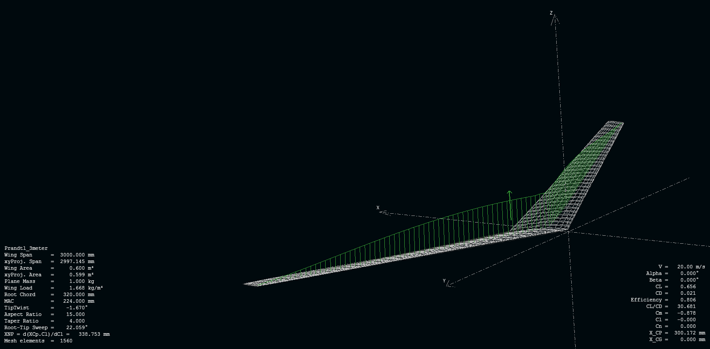

# aerodynamics

This is an experimental project to test a different lift distribution design method in:

The video footage of the powered test flight is available in:

https://youtu.be/wN5asplsBwE

The flight test with silk ribbon attached to the trailing edge shows agreement with the simulation result below.
All CAD design files and matlab script used to synthesize the CAD file are available in folder DesignFiles and Prandtl-D.

A laser cutting machine is suggested to be used for producing the building parts.

https://youtu.be/ouQx5Ufc19I

